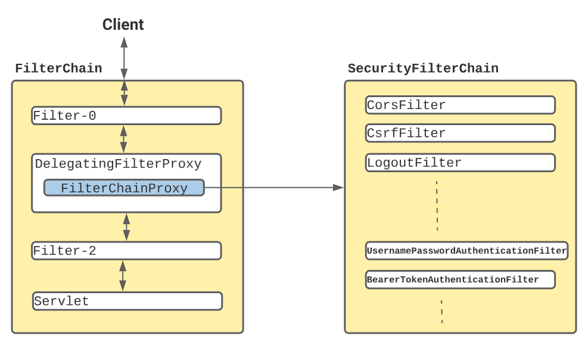
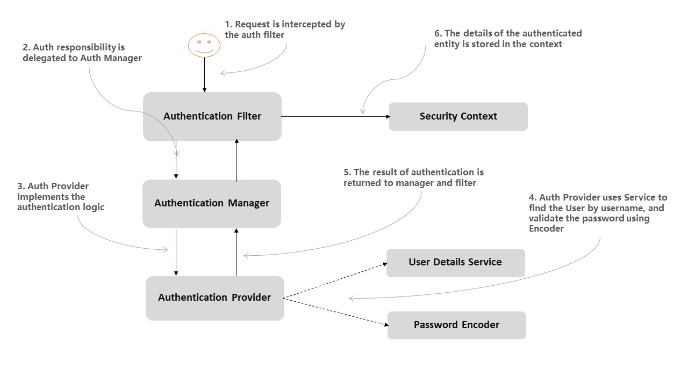

How Spring handles the requests -
Dispatcher Servlet -> HandlerMapping(Choose Handler) -> Handler Adapter -> Rest Controller

Dispatcher Servlet:
*     DispatcherServlet is responsible for handling incoming HTTP requests and delegating it to appropriate controllers for processing.
*     DispatcherServlet - Act as a Front controller(Controller that handles all incoming request of an application)
*         provides a mechanism for request processing but actual work done by controllers
*         Can have multiple DispatcherServlet for different context root(/)
*         uses **Spring configuration classes** to discover and delegate for mappings
*     How DispatcherServlet uses WebApplicationContext for mapping -
*         Our application objects live in Java Bean Container(create objects and manage its life cycle). These objects are called Spring managed Beans.
*     and the container is called ApplicationContext.
*         WebApplicationContext is an extension of ApplicationContext with web aware. It has ServletContext information.
*         When DispatcherServlet is loaded, it looks for the bean configuration file (XML configuration) or @Configuration classes and initializes it.
* 
HandlerMapping:
*     DispatcherServlet consult with HAndlerMapping to select which controller should serve the request based on request URL, request method, or other parameters.
*     Once mapper maps the request to handler it returns the details to DispatcherServlet
* 
HandlerAdapter:
*     Dispatcher servlet needs the assistance of a HandlerAdapter to invoke the method (handler) with the correct parameters.
* 
How Spring Security works -
*     Uses Servlet Filters(to intercept and do certain task before or after the request)
*     When a request is sent container creates **filterchain** that contains **Filter instance** and **servlet** that should process the request.
*     While starting **Spring register a Filter - DelegatingFilterProxy  with name springSecurityFilterChain**
*     
*     Once request reach registered filters inside SecurityFilterChain.
* 
Basic terms:
Authentication - Who are you

Authorization - what are all the things you can access

Principal - currently logged-in user

Granted Authority - list of things logged-in user can do

Roles - Group of authorities can be assigned to logged-in user

Security Context and SecurityContextHolder - which holds currently authenticated user to use all over the application
    Authentication authentication = SecurityContextHolder.getContext().getAuthentication();

UserDetails - interface provided by spring security to represent user information to be used for authentication and authorization
    Username, Password, Enabled, AccountNonExpired, credentialsNonExpired, accountNonLocked and Authorities
    we can implement UserDetails to use custom user entity with Spring security

UserDetailsService - interface provided by spring security to retrieve user related data
    loadUserByUsername(String username)  - return UserDetails which will be used for authentication and authorization process
    we can implement our own UserDetailsService by creating a new service which will connect to our database to get user details
and converts them into UserDetails object.

AuthenticationManager - interface which is core of spring security authentication process
    authenticate( **Authentication** authentication)
    act as a orchestrator by delegating the process to different AuthenticationProvider
    when implementing this interface, class has **all logic for authenticating a user request.**
    Spring default implementation -> ProviderManager which delegates authentication request to AuthenticationProvider

AuthenticationProvider - can handle specific type of **authentication** (username and password, token-based authentication)
based on the Authentication object passed to AuthenticationManager it routes the request to provider who can handle.

AuthenticationManager(Authenticate) -> AuthenticationProvider -> Authentication object -> Principal
and Granted Authorities store in SecurityContext for authorization checks

User credentials -> Authentication Token Creation -> Creates Authentication token -> AuthenticationManager  -> authenticate 
token using AuthenticationProvider -> On successful authentication, Authentication token is stored in SecurityContextHolder

    1. Authentication Filter - Request intercepted by auth filter
    2. Authentication Manager - Auth responsibility is delegated to Auth Manager
    3. Authentication Provider - Auth provider implements the authentication logic
        User Details Service - Auth provider uses Service to find the User by username
        Password Encoder - validate the user using Encoder
    4. Authentication - The result of authentication is returned to manager and filter
    5. Security Context - authenticated entity is stored in security context for usage
Note: WebSecurityConfigurerAdapter deprecated. We can configure HttpSecurity by creating a **SecurityFilterChain** bean.
Default security provided by spring: Form Based
1. Add Spring security dependency. steps done by spring boot app while adding dependency
   Creates a bean named springSecurityFilterChain. Registers the Filter with a bean named springSecurityFilterChain with the Servlet container for every request.
   HTTP basic authentication for authenticating requests made with remoting protocols and web services.
   Generate a default login form.
   Creates a user with a username of user and a password that is logged to the console.
   Protects the password storage with BCrypt.
   Enables logout feature.
   Servlet API integration to access security information via standard Servlet APIs, such as HttpServletRequest.isUserInRole() and HttpServletRequest.getUserPrincipal().
   Other features such as protection from CSRF attacks, session fixation and clickjacking.

2. Create rest endpoint and start the application
3. try to access localhost:8080 login form will appear
4. Username = user, Password = check the app start logs
5. Change default credentials using spring.security.user.name=uname & spring.security.user.password=password

In-memory Authentication:
1. Provide a bean of InMemoryUserDetailsManager which is a implementation of UserDetailService provides User list
2. Create User object which is a implementation of UserDetails
3. Provide a bean of PasswordEncoder
4. While using Inmemory authentication password provided through spring.security.user.name=uname & spring.security.user.password=password won't work
will give Bad Credentials. Only in memory User details work.
5. Add @Configuration to register the beans and @EnableWebSecurity to configure spring security related beans.
6. Refer Controller class to see how to get Authentication details
InMemoryUserDetailsManager implements UserDetailsService to provide uname and passw based authentication stored in memory.
provides UserDetails by implementing UserDetailsManager interface.

We can provide custom implementation for UserDetailService and UserDetails for db managed authentication.

